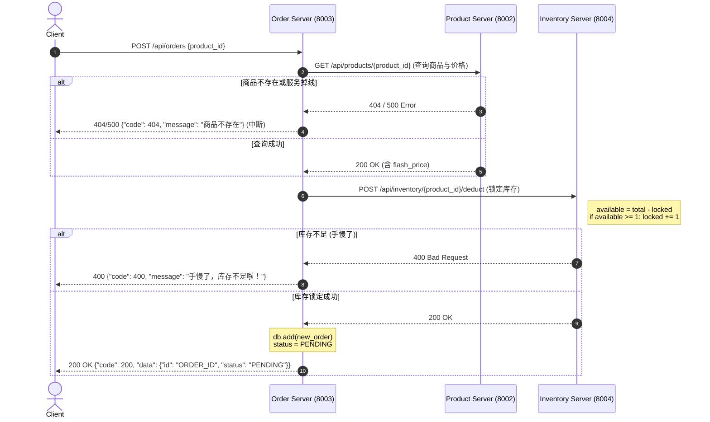

# 分布式秒杀微服务架构与 API 规范指南

## 项目概述
本项目包含四大微服务 (`User`, `Product`, `Order`, `Inventory`)，支撑完整的秒杀/购物下单流程。每个服务均拥有自己独立的数据库，服务间通过无状态的 HTTP REST API 进行通信。本文档旨在详细描述最新的 API 响应规范、订单流程时序图、系统核心行为分析以及保障系统最终一致性的机制设计（如幂等性）。

---

## 统一响应规范
为提升前后端协同及错误追踪效率，所有接口返回值（含正常与异常）现已重构为如下统一 JSON 结构：
```json
{
  "code": 200,          // 业务状态码
  "message": "success", // 业务提示信息
  "data": { ... }       // 实际有效载荷，错误时通常为 null
}
```

**业务状态码对照表：**
- `200`: 成功处理。
- `400`: 业务校验失败或常规错误 (例如库存不足、参数有误)。
- `401`: 未授权 (Token 无效或已过期)。
- `404`: 请求的资源不存在。
- `422`: 表单格式/请求体验证异常。
- `500`: 系统内部处理异常或跨微服务通信熔断。

---

## 核心接口清单与示例

### User Service (Port: 8001)

| 功能说明 | 请求方式 & 路径            | 参数 / Body示例                          | 响应示例                                                                                                             |
| :------- | :------------------------- | :--------------------------------------- | :------------------------------------------------------------------------------------------------------------------- |
| 用户注册 | `POST /api/users/register` | `{"username": "bob", "password": "123"}` | `{"code": 200, "message": "注册成功", "data": {"id": "uuid", "username": "bob"}}`                                    |
| 用户登录 | `POST /api/users/login`    | `{"username": "bob", "password": "123"}` | `{"code": 200, "message": "登录成功", "data": {"access_token": "ey...", "token_type": "bearer", "user_id": "uuid"}}` |

### Product Service (Port: 8002) *(创建操作需带 Bearer Token)*

| 功能说明 | 请求方式 & 路径                      | 参数 / Body示例                                                   | 响应示例                                                                                                                                                                            |
| :------- | :----------------------------------- | :---------------------------------------------------------------- | :---------------------------------------------------------------------------------------------------------------------------------------------------------------------------------- |
| 创建商品 | `POST /api/products`                 | `{"name": "iPhone", "description": "Apple", "flash_price": 4999}` | `{"code": 200, "message": "商品创建成功", "data": {"id": "uuid", "name": "iPhone", ...}}`                                                                                           |
| 查询列表 | `GET /api/products?skip=0&limit=100` | `-`                                                               | `{"code": 200, "message": "成功获取商品列表", "data": [{...}]}`                                                                                                                     |
| 查询详细 | `GET /api/products/{product_id}`     | `-`                                                               | `{"code": 200,"message": "成功获取商品详情","data": {"id": "019cffc1ad5a71f0b8dc4b1cfa1cc3eb","name": "苹果10斤","description": "好吃","original_price": 39.9,"flash_price": 9.9}}` |

### Order Service (Port: 8003) *(所有操作均需鉴权)*

| 功能说明 | 请求方式 & 路径                | 参数 / Body示例               | 响应示例                                                                                         |
| :------- | :----------------------------- | :---------------------------- | :----------------------------------------------------------------------------------------------- |
| 创建订单 | `POST /api/orders`             | `{"product_id": "prod-uuid"}` | `{"code": 200, "message": "订单创建成功", "data": {"id": "ord-uuid", "status": "PENDING", ...}}` |
| 支付订单 | `POST /api/orders/{id}/pay`    | `-`                           | `{"code": 200, "message": "付款成功！老板大气！", "data": {"order_id": "...","status":"PAID"}}`  |
| 取消订单 | `POST /api/orders/{id}/cancel` | `-`                           | `{"code": 200, "message": "订单已取消...", "data": {"order_id": "...","status":"CANCELLED"}}`    |

### Inventory Service (Port: 8004)

| 功能说明         | 请求方式 & 路径                    | 参数 / Body示例                              | 响应示例                                                                          |
| :--------------- | :--------------------------------- | :------------------------------------------- | :-------------------------------------------------------------------------------- |
| 设置/增加库存    | `POST /api/inventory`              | `{"product_id": "uuid", "total_stock": 100}` | `{"code": 200, "message": "库存设置成功", "data": {"available_stock": 100, ...}}` |
| 查询库存         | `GET /api/inventory/{id}`          | `-`                                          | `{"code": 200, "message": "查询库存成功", "data": {"available_stock": 100, ...}}` |
| 锁定库存(防超卖) | `POST /api/inventory/{id}/deduct`  | `{"quantity": 1}`                            | `{"code": 200, "message": "库存锁定成功！", "data": {"locked_quantity": 1}}`      |
| 确认扣除(付款后) | `POST /api/inventory/{id}/confirm` | `{"quantity": 1}`                            | `{"code": 200, "message": "付款成功，库存真实扣减完毕！", "data": null}`          |
| 释放库存(取消后) | `POST /api/inventory/{id}/release` | `{"quantity": 1}`                            | `{"code": 200, "message": "订单已取消，库存已重新释放回奖池！", "data": null}`    |

---

## 下单链路与库存交互时序流转

`create_order` 是整个秒杀系统中最核心的方法。该操作横跨了 Order、Product、Inventory 多个服务，采用了 **两阶段** 的库存概念（锁定库存 + 真实扣减/释放），以防止恶意锁库存但不买的情况。

### 时序图 (Mermaid)



### `create_order` 内部状态流转分析
1. **询查价格**：网关首先验证 Token 获得 `user_id`。订单服务无该商品信息，立即向 Product 发请求，阻截假商品的情况；若下游挂掉，本级捕捉到并上抛500报错。
2. **防超卖的库存判定（TCC架构思维中的 Try）**：订单未落库前，先向 Inventory 申请库存锁（locked_stock 增加）。这是一个悲观锁概念的延伸，我们保证在此次操作没有完成之前，其他并发请求扣去可用量。若此处返回 `400`，说明真实可卖件数不足。
3. **本地事务（订单入库）**：库存成功上锁后，订单信息落地到当前数据库，状态设置为 `PENDING`。此时操作完毕，向客户抛出“下单成功”喜讯。
   *（注：若此步数据库宕机导致入库失败，会残留下库存的死锁孤儿记录。实际工业级往往需借助消息队列、补偿定时任务对其进行清理）*

## 幂等性与副作用设计策略

基于微服务间的网状网络调用，请求极易因网络抖动发生超时（Timeout）。重试机制可能会让部分接口被多次激活，因此部分接口需具备 **幂等性 (Idempotency)**。

### 1. 副作用操作：扣库存（`/deduct`）
- **非幂等现状**：在目前的演示版本中，如果同一个订单创建被重复调用 `/deduct`，库存会真实地被加锁多次。这属于典型的非幂等接口。
- **改进方式**：为了实现扣库存的幂等，未来需要在 `/deduct` 的请求体中传入唯一防重放的凭证（如 `uuidv7` 生成的全局 `request_id` 或者最终落地订单的 `order_id` 前置生成）。由于订单号目前是在最后一步本地 MySQL 自增生成，架构演进时可引入 SnowFlake 或 UUID 作为业务键提前预占。

### 2. 幂等操作的典范范式：支付订单与取消订单
- `/pay` 与 `/cancel` 目前是幂等的。虽然其依赖远程调用，但基于数据库记录的状态判断 `if order.status != "PENDING"`，能够拦截掉已经付款或者取消的同一号单的二次重发。
- **库存服务的释放与确认逻辑补偿**：Inventory 的 `/api/inventory/{id}/confirm` 与 `/release` 目前单纯依赖了 `locked -= 1` 等代数运算，它本身并不是绝对防重的。如果在工业场景下重试，则可能会把 `locked_stock` 扣成负数。因此应当在 Inventory 表加设一层交易水单明细表 (Transaction Log)，一旦某笔特定的单号被消费处理完毕，拒绝相同的确认与释放请求。这是应对多组件分布式事务“副作型蔓延”的重要约束机制。
