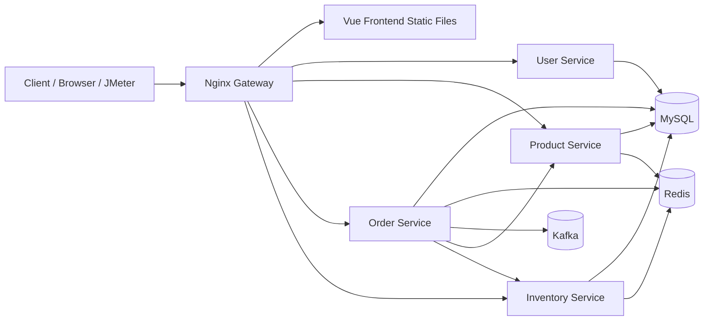

# 分布式秒杀系统作业项目

## 项目简介

这是一个基于 `FastAPI + MySQL + Redis + Kafka + Nginx + Vue 3 + Docker Compose` 实现的分布式秒杀课程作业项目。系统按业务拆分为用户、商品、订单、库存四个微服务，通过 HTTP REST 接口通信，并在统一入口层引入 Nginx，实现容器化部署、反向代理、负载均衡、动静分离、商品详情缓存，以及基于消息队列的异步秒杀下单。

当前项目已经完成基础业务接口，以及课程要求中的容器环境、负载均衡、JMeter 压测、动静分离、Redis 缓存、缓存治理、商品服务读写分离，以及“Redis 预扣库存 + Kafka 异步创建订单”的秒杀链路。

## 当前完成情况

- [x] 用户服务：注册、登录、JWT 鉴权
- [x] 商品服务：商品创建、商品列表、商品详情
- [x] 库存服务：库存设置、库存查询、库存锁定、库存确认、库存释放
- [x] 订单服务：创建订单、支付订单、取消订单
- [x] 统一响应结构与基础异常处理
- [x] Dockerfile 与 `docker-compose.yml` 容器化部署
- [x] Nginx 统一网关与反向代理
- [x] 负载均衡实验
- [x] 前端静态资源部署与动静分离
- [x] JMeter 对静态资源和后端接口进行压力测试
- [x] Redis 商品详情页缓存
- [x] 缓存穿透治理
- [x] 缓存击穿治理
- [x] 缓存雪崩治理
- [x] MySQL 读写分离示例
- [x] Redis 缓存库存
- [x] Kafka 异步秒杀下单
- [x] 雪花算法订单 ID
- [x] 同一用户同一商品幂等下单
- [x] 秒杀库存最终一致性补偿

## 系统架构



## 技术栈

- 后端：`FastAPI`、`SQLAlchemy`、`httpx`
- 数据库：`MySQL 8`
- 缓存：`Redis`
- 消息队列：`Kafka`
- 网关：`Nginx`
- 前端：`Vue 3`、`Vite`、`Tailwind CSS`
- 容器化：`Docker`、`Docker Compose`
- 压测：`JMeter`

## 服务划分

| 服务 | 说明 | 容器内端口 |
| --- | --- | --- |
| `user_service` | 用户注册、登录、鉴权 | `8001` |
| `product_service` | 商品管理、商品详情、Redis 缓存 | `8002` |
| `order_service` | 秒杀下单、异步建单、支付、取消、按用户/订单查询 | `8003` |
| `inventory_service` | 库存设置、查询、传统锁库存、秒杀库存最终扣减/回补 | `8004` |
| `mysql-db` | 持久化存储 | `3306` |
| `flash-redis` | 商品详情缓存 | `6379` |
| `kafka` | 秒杀异步削峰 | `9092` |
| `nginx-gateway` | 静态资源分发、API 网关、负载均衡入口 | `80` |

宿主机默认访问入口：

- 前端与统一网关：`http://localhost:8000`
- MySQL：`localhost:3306`
- 商品主库：`localhost:3307`
- 商品从库：`localhost:3308`
- Redis：`localhost:6379`
- Kafka：`localhost:9094`

## 目录结构

```text
distributed-flash-sale/
├── docker-compose.yml
├── nginx/
│   └── nginx.conf
├── frontend/
├── user_service/
├── product_service/
├── order_service/
├── inventory_service/
├── integration_test.py
└── README.md
```

## 已实现的核心内容

### 1. 基础业务能力

项目目前已经完成以下基础接口：

- 用户：`/api/users/register`、`/api/users/login`
- 商品：`POST /api/products`、`GET /api/products`、`GET /api/products/{product_id}`
- 订单：`POST /api/orders`、`GET /api/orders/{order_id}`、`GET /api/orders/user/{user_id}`、`POST /api/orders/{order_id}/pay`、`POST /api/orders/{order_id}/cancel`
- 库存：`POST /api/inventory`、`GET /api/inventory/{product_id}`、`POST /api/inventory/{product_id}/flash-sale/preload`、`POST /api/inventory/{product_id}/flash-sale/commit`、`POST /api/inventory/{product_id}/flash-sale/restore`、`POST /api/inventory/{product_id}/deduct`、`POST /api/inventory/{product_id}/confirm`、`POST /api/inventory/{product_id}/release`

当前订单服务同时保留了两条链路：

- 基础演示链路：先锁库存，再支付确认/取消释放
- 秒杀链路：Redis 预扣库存，Kafka 异步创建订单，库存服务最终扣减数据库库存

### 2. 容器环境

项目已经配置好多服务的 Docker 相关文件：

- 每个后端服务目录下都提供了 `Dockerfile`
- `frontend/Dockerfile` 使用多阶段构建，先打包 Vue 前端，再交给 Nginx 提供静态资源
- 根目录 `docker-compose.yml` 用于统一拉起 MySQL、Redis、后端服务和 Nginx 网关

当前 Compose 编排包含：

- `mysql-db`
- `mysql-master`
- `mysql-slave`
- `flash-redis`
- `kafka`
- `user-service`
- `product-service`
- `order-service`
- `inventory-service`
- `nginx-gateway`

说明：

- MySQL 容器启动时会自动创建 `flash_user_db`
- `product_service`、`order_service`、`inventory_service` 启动时会自动检查并创建各自数据库

### 3. 负载均衡

项目通过 Nginx 的 `upstream` 实现反向代理与负载均衡。当前仓库中已经在 `nginx/nginx.conf` 中配置了多个服务的 upstream 池，并将 `/api/*` 请求转发到后端服务。

其中，`product-service` 已作为负载均衡实验对象进行多实例配置预留。默认可采用 Nginx 轮询策略；如需做课程实验对比，也可以在 `upstream` 中切换为以下策略：

- 默认轮询 `round robin`
- 权重轮询 `weight`
- 最少连接 `least_conn`
- IP 绑定 `ip_hash`

### 4. 动静分离

项目已经完成动静分离配置：

- `location /`：由 Nginx 直接返回前端静态资源
- `location /api/users`：转发到用户服务
- `location /api/products`：转发到商品服务
- `location /api/orders`：转发到订单服务
- `location /api/inventory`：转发到库存服务

### 5. 分布式缓存

项目已经在商品服务中引入 Redis，对商品详情接口做了基础缓存与防护治理。

当前缓存逻辑位于 `product_service/api/routes.py`：

- 查询商品详情时，优先读取 Redis
- 缓存命中则直接返回
- 缓存未命中时查询 MySQL
- 查询到数据后写回 Redis
- 缓存 Key 格式：`product:{product_id}`
- 正常商品缓存采用随机过期时间，避免大量 Key 同时失效
- 不存在商品会写入空值缓存，减少恶意不存在请求反复打库
- 商品 ID 会同步到 Redis 索引集合，优先过滤明显非法请求
- 缓存重建时使用 Redis 分布式锁，避免热点 Key 失效瞬间大量并发同时回源

当前实现对应关系：

- 缓存穿透：商品 ID 索引 + 空值缓存
- 缓存击穿：互斥锁 + 等待缓存回填
- 缓存雪崩：缓存 TTL 随机抖动

### 6. 消息队列秒杀下单

项目已经实现基于 `Redis + Kafka` 的异步秒杀链路，核心目标是把高并发抢购流量挡在缓存和队列层，而不是直接把数据库打满。

实现要点如下：

- 秒杀入口先在 Redis 中原子校验库存和重复下单，再做库存预扣
- 入口线程生成雪花订单 ID，把订单事件投递到 Kafka 后立即返回“排队中”
- 订单服务后台消费者异步查询商品价格、创建订单、调用库存服务做最终扣减
- 同一用户同一商品通过 Redis 用户标记和数据库唯一约束双重兜底
- 消费失败时自动补偿 Redis 库存，避免“库存少了但订单没创建”的假死状态
- 取消订单时，库存服务会同时回补数据库库存和 Redis 可售库存

专项文档：

- [缓存问题治理说明.md](./缓存问题治理说明.md)
- [读写分离实现说明.md](./读写分离实现说明.md)
- [消息队列秒杀实现说明.md](./消息队列秒杀实现说明.md)

## JMeter 压测说明

项目已使用 JMeter 对静态资源和后端接口进行压力测试，主要观察以下内容：

- 静态资源访问响应时间
- 后端接口响应时间
- 吞吐量与错误率
- 后端实例的请求分发情况是否大致均衡

建议压测目标：

- 静态资源：`GET http://localhost:8000/`
- 商品列表：`GET http://localhost:8000/api/products`
- 商品详情：`GET http://localhost:8000/api/products/{product_id}`

观察方式：

- 查看 JMeter 的平均响应时间、吞吐量、错误率
- 查看 Nginx 与后端日志，确认请求是否被分发到多个实例

## 统一响应格式

项目中的接口统一返回如下结构：

```json
{
  "code": 200,
  "message": "success",
  "data": {}
}
```

## 快速启动

使用 Docker Compose

推荐直接在项目根目录执行：

```bash
docker compose up -d --build
```

如果你之前已经启动过旧版本，且本次要验证新的订单/库存表结构，建议先做一次干净重建：

```bash
docker compose down -v
docker compose up -d --build
```

如果需要验证商品服务多实例负载均衡：

```bash
docker compose up -d --build --scale product-service=3
```

启动完成后可访问：

- 前端首页：`http://localhost:8000`
- 用户接口：`http://localhost:8000/api/users`
- 商品接口：`http://localhost:8000/api/products`
- 订单接口：`http://localhost:8000/api/orders`
- 库存接口：`http://localhost:8000/api/inventory`

## 验证建议

- 先通过 `POST /api/inventory` 为商品初始化库存，库存服务会同步预热 Redis 秒杀库存
- 调用 `POST /api/orders` 发起秒杀，请求会先返回排队中的订单 ID
- 立刻调用 `GET /api/orders/{order_id}`，可以观察订单从 `QUEUED` / `PROCESSING` 过渡到 `PENDING_PAYMENT`
- 查看 `docker compose logs -f order-service`，可以看到 Kafka 消费与异步建单日志
- 查看 `docker compose logs -f inventory-service`，可以确认数据库最终扣减和取消回补是否发生

## 可补充的后续工作

- 为负载均衡实验补充更完整的 JMeter 测试报告和截图
- 为热点商品加入更稳健的限流、熔断与降级机制
- 进一步完善接口文档与自动化测试
